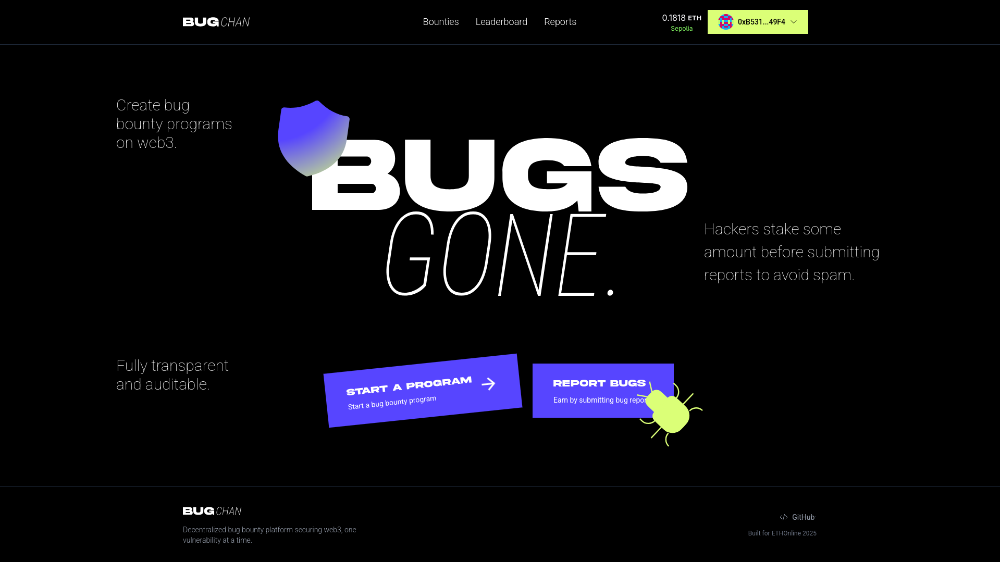

# BugChan
[BugChan](https://bugchan.xyz) is a decentralized bug-bounty platform built at [ETHOnline 2025](https://ethglobal.com/events/ethonline2025/). It makes vulnerability disclosure transparent, trustless, and censorship-resistant by combining on‑chain escrow, encrypted off‑chain reports, and blockchain-native attestations.

---

## Overview

- Projects post bounties on-chain and lock rewards in escrow.  
- Researchers submit encrypted vulnerability reports to IPFS (via Lighthouse).  
- Approved reports trigger automated payouts from escrow.

---

## Tech stack

- Frontend: Next.js (App Router) + Tailwind CSS  
- Smart contracts: Solidity, Hardhat  
- Wallets: Wagmi + RainbowKit  
- Storage: Lighthouse
- Payments: onchain

---

## Core features

- On‑chain escrow: secure, auditable funds lockup.  
- Encrypted submissions: private uploads via Lighthouse.  
- Automatic payouts: smart contracts release rewards on approval.  
- Transparent history: all bounties & payouts visible on-chain.  
- Tokenomics & anti‑spam: stake requirement for submissions; forfeited stake funds the system & deters spam.  
- Reputation: attestations provide on‑chain trust signals.

---

## Architecture overview

1. User posts bounty via frontend → smart contract creates escrow.  
2. Researcher encrypts report and uploads to Lighthouse/IPFS. CID and encryption metadata are stored off‑chain; reference is added on‑chain as needed.  
3. Project reviews submission; on approval, the contract releases funds to researcher.  

---

Notes:
- Prototype: under active development.
- Built using [Scaffold-ETH](https://scaffoldeth.io/) (Scaffold-ETH2)
- License: [MIT](https://opensource.org/licenses/MIT)
